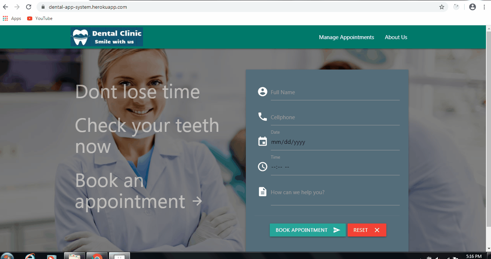

# dental-app-system
MERN stack web application built for dental clinics to manage their client appointments. 

## Technologies used: 
* **FrontEnd:** HTML5, CSS3, Materialize CSS, ReactJS
* **Backend:** Node.js, MongoDB, Express, JSON web tokens

## Application Demo:

